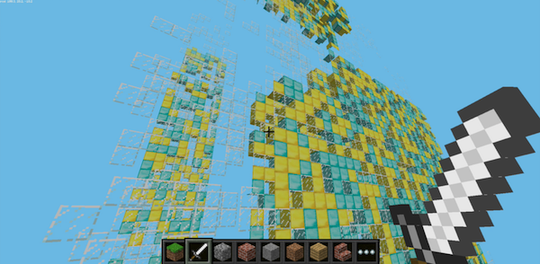
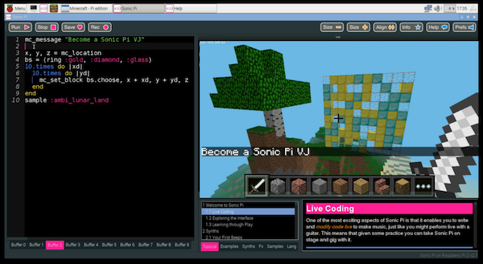

A.8 Become a Minecraft VJ

# Become a Minecraft VJ



Everyone has played Minecraft. You will all have built amazing
structures, designed cunning traps and even created elaborate cart lines
controlled by redstone switches. How many of you have performed with
Minecraft? We bet you didn't know that you could use Minecraft to create
amazing visuals just like a professional VJ.

If your only way of modifying Minecraft was with the mouse, you'd have a
tough time changing things fast enough. Luckily for you your Raspberry
Pi comes with a version of Minecraft that can be controlled with
code. It also comes with an app called Sonic Pi which makes coding
Minecraft not only easy but also incredibly fun.

In today's article we'll be showing you some of the tips and tricks that
we've used to create performances in night clubs and music venues around
the world.

Let's get started...

## Getting Started

Let's start with a simple warm up exercise to refresh ourselves with the
basics.  First up, crack open your Raspberry Pi and then fire up both
Minecraft and Sonic Pi. In Minecraft, create a new world, and in Sonic
Pi choose a fresh buffer and write in this code:

```
mc_message "Let's get started..."
```
    
Hit the Run button and you'll see the message over in the Minecraft
window. OK, we're ready to start, let's have some fun......

## Sand Storms

When we're using Minecraft to create visuals we try and think about what
will both look interesting and also be easy to generate from code. One
nice trick is to create a sand storm by dropping sand blocks from the
sky. For that all we need are a few basic fns:

* `sleep` - for inserting a delay between actions
* `mc_location` - to find our current location
* `mc_set_block`-  to place sand blocks at a specific location
* `rrand` - to allow us to generate random values within a range
* `live_loop` - to allow us to continually make it rain sand

If you're unfamiliar with any of the built-in fns such as `rrand`, just
type the word into your buffer, click on it and then hit the keyboard
combo `Control-i` to bring up the built-in documentation. Alternatively
you can navigate to the *lang* tab in the Help system and then look up
the fns directly along with all the other exciting things you can do.

Let's make it rain a little first before unleashing the full power of
the storm. Grab your current location and use it to create a few sand
blocks up in the sky nearby:

```
x, y, z = mc_location
mc_set_block :sand, x, y + 20, z + 5
sleep 2
mc_set_block :sand, x, y + 20, z + 6
sleep 2
mc_set_block :sand, x, y + 20, z + 7
sleep 2
mc_set_block :sand, x, y + 20, z + 8
```
    
When you hit Run, you might have to look around a little as the blocks
may start falling down behind you depending on which direction you're
currently facing. Don't worry, if you missed them just hit Run again for
another batch of sand rain - just make sure you're looking the right
way!

Let's quickly review what's going on here. On the first line we grabbed
Steve's location as coordinates with the fn `mc_location` and placed
them into the vars `x`, `y`, and `z`. Then on the next lines we used the
`mc_set_block` fn to place some sand at the same coordinates as Steve
but with some modifications. We chose the same x coordinate, a y
coordinate 20 blocks higher and then successively larger z coordinates
so the sand dropped in a line away from Steve.

Why don't you take that code and start playing around with it yourself?
Try adding more lines, changing the sleep times, try mixing `:sand` with
`:gravel` and choose different coordinates. Just experiment and have fun!

## Live Loops Unleashed

OK, it's time to get the storm raging by unleashing the full power of
the `live_loop` - Sonic Pi's magical ability which unleashes the full
power of live coding - changing code on-the-fly whilst it's running!

```
live_loop :sand_storm do
  x, y, z = mc_location
  xd = rrand(-10, 10)
  zd = rrand(-10, 10)
  co = rrand(70, 130)
  synth :cnoise, attack: 0, release: 0.125, cutoff: co
  mc_set_block :sand, x + xd, y+20, z+zd
  sleep 0.125
end
```
    
What fun! We're looping round pretty quickly (8 times a second) and
during each loop we're finding Steve's location like before but then
generating 3 random values:

* `xd` - the difference for x which will be between -10 and 10
* `zd` - the difference for z also between -10 and 10
* `co` - a cutoff value for the low pass filter between 70 and 130

We then use those random values in the fns `synth` and `mc_set_block`
giving us sand falling in random locations around Steve along with a
percussive rain-like sound from the `:cnoise` synth.

For those of you new to live loops - this is where the fun really starts
with Sonic Pi. Whilst the code is running and the sand is pouring down,
try changing one of the values, perhaps the sleep time to `0.25` or the
`:sand` block type to `:gravel`. Now hit run *again*. Hey Presto! Things
changed without the code stopping. This is your gateway to performing
like a real VJ. Keep practising and changing things around. How
different can you make the visuals without stopping the code?

## Epic Block Patterns



Finally, another great way of generating interesting visuals is to
generate huge patterned walls to fly towards and close by. For this
effect we'll need to move from placing the blocks randomly to placing
them in an ordered manner. We can do this by nesting two sets of
iteration (hit the Help button and navigate to section 5.2 of the
tutorial "Iteration and Loops" for more background on iteration). The
funny `|xd|` after the do means that `xd` will be set for each value of
the iteration. So the first time it will be 0, then 1, then 2... etc. By
nesting two lots of iteration together like this we can generate all the
coordinates for a square. We can then randomly choose block types from a
ring of blocks for an interesting effect:

```
x, y, z = mc_location
bs = ring(:gold, :diamond, :glass)
10.times do |xd|
  10.times do |yd|
    mc_set_block bs.choose, x + xd, y + yd, z
  end
end
```

Pretty neat. Whilst we're having fun here, try changing `bs.choose` to
`bs.tick` to move from a random pattern to a more regular one. Try
changing the block types and the more adventurous of you might want to
try sticking this within a `live_loop` so that the patterns keep changing
automatically.

Now, for the VJ finale - change the two `10.times` to `100.times` and
hit Run. Kaboom! A Huge gigantic wall of randomly placed bricks. Imagine
how long it would take you to build that manually with your mouse!
Double-tap space to enter fly-mode and start swooping by for some great
visual effects. Don't stop here though - use your imagination to conjure
up some cool ideas and then use the coding power of Sonic Pi to make it
real. When you've practised enough dim the lights and put on a VJ show
for your friends!
